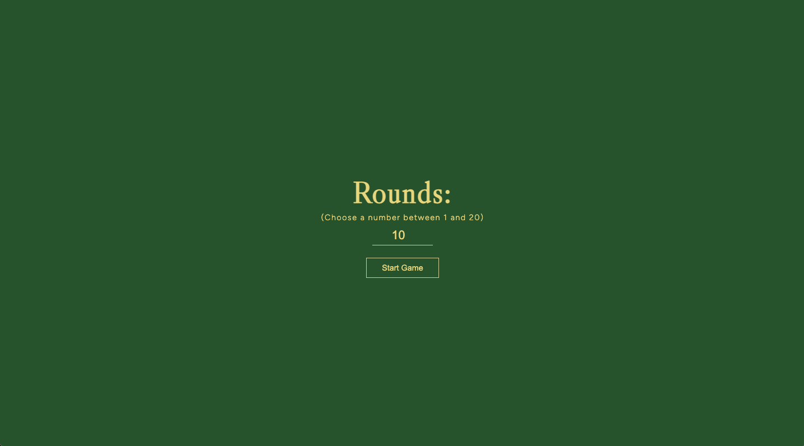
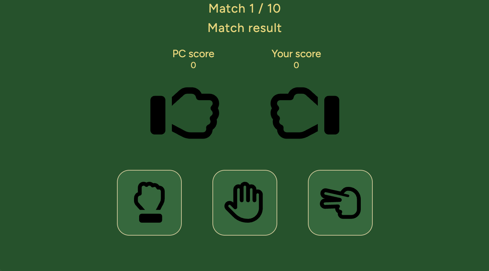
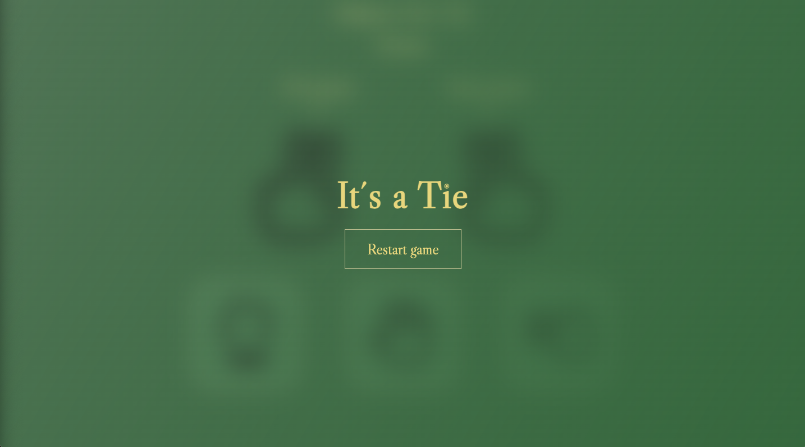

<h1>✊ ✋ ✌ Rock, Paper, Scissors – TypeScript Project</h1>

A simple, interactive **Rock, Paper, Scissors** game against the computer – built with **TypeScript**, **HTML**, and **CSS**.

## Features

- Custom number of rounds (1–20)
- Random computer choice each round
- Interactive user selection (rock, paper, scissors)
- Animated hand icons
- Score tracking & round counter
- Game over screen with result and restart option

## Game Rules

- ✊ Rock beats ✌ Scissors
- ✋ Paper beats ✊ Rock
- ✌ Scissors beats ✋ Paper
- Draw = no points

## Technologies Used

- **TypeScript** – game logic & DOM interaction
- **HTML5** – structure and layout
- **CSS3** – design, transitions, and animations

## How It Works

1. Enter number of rounds (1–20)
2. Click “Start Game” to reveal the game UI
3. Select ✊, ✋ or ✌ to play
4. See the animations, scores, and progress
5. Final result is shown at the end, with option to restart

## Screenshots

This is a [SuperCode](https://www.super-code.de/) Project. This page was created as part of the SuperCode Bootcamp “AI WebApp Solution Engineer” in Module 2.
